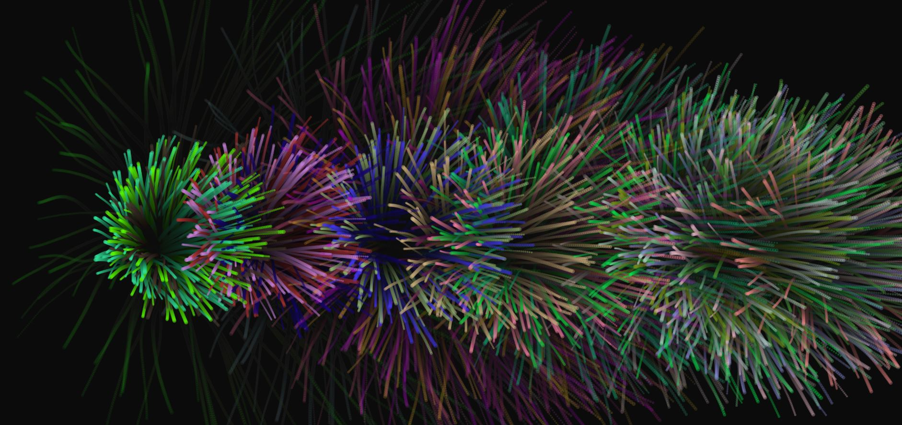

Fireworks Perlin Noise Creative Coding Project
============

This is a creative coding experiment that utilizes perlin noise and particles to create a intriguing firework animation that can be run efficiently on most browsers. It presents one of the many possibilities that P5.JS (a javascript library) has to offer.

## Tech 
This project focuses on understanding the fundamentals of P5.JS which is a JavaScript Library meant to allow creative coding to be accessible by all. The highlight of this project focuses how arrays can be used to store data that can be accessed by the browser to create unique and intriguing visualizations on the client side.

## Setup
Clone this repo to your desktop and run in the browser. It's that easy!

## Try it out
[Perlin Noise Experience](https://tuck1297.github.io/CreativeCodingFireworksPerlinNoise/)

